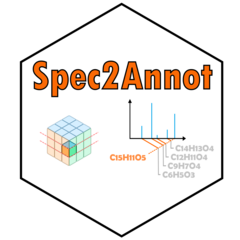

# Spec2Annot 

<!-- badges: start -->
[](https://lifecycle.r-lib.org/articles/stages.html#experimental)
[](https://app.codecov.io/gh/odisce/Spec2Annot?branch=main)
[](https://github.com/odisce/Spec2Annot/actions/workflows/R-CMD-check.yaml)
<!-- badges: end -->

**Spec2Annot** is an [R](https://www.r-project.org/) package which implement different ways to annotate 
and query mass spectra. An implementation on [Galaxy](https://workflow4metabolomics.usegalaxy.fr/) of those 
functionalities is under progress.

## Installation

You can install the development version of Spec2Annot from [GitHub](https://github.com/) with:

``` r
# install.packages("devtools")
devtools::install_github("odisce/Spec2Annot")
```

## Example

This is a basic example which shows you how to solve a common problem:

``` r
library(Spec2Annot)
## basic example code
```

